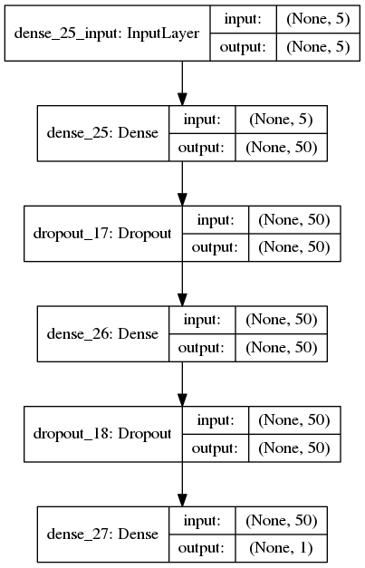
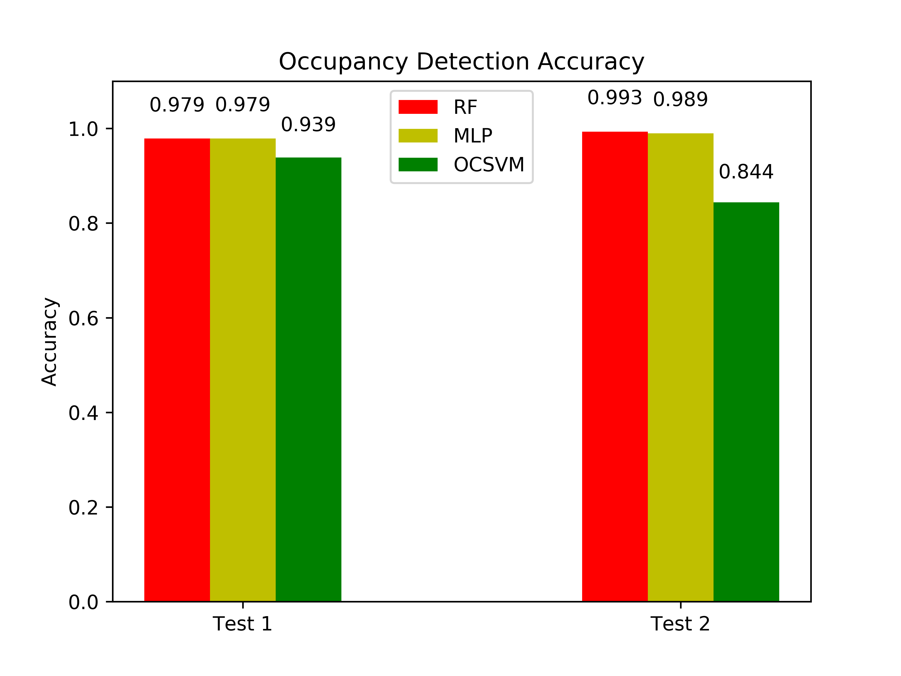
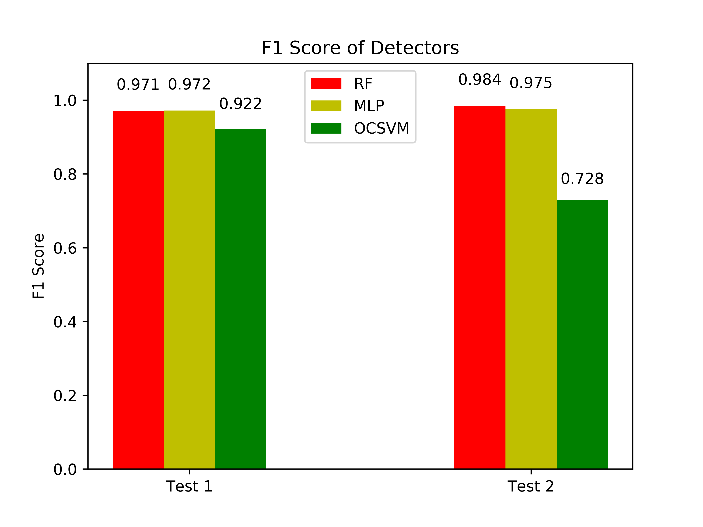

# occupancy-detection
My attempt on the [UCI Occupancy Detection](https://archive.ics.uci.edu/ml/datasets/Occupancy+Detection+) dataset using various methods.

**Scoring >98% with a Random Forest and a Deep Feed-forward Neural Network (MLP) as of now.**

## Tested Methods
* Random Forest (RF), Supervised Learning
* Multi-Layer Perceptron (ANN) with weighted classes and dropout, Supervised Learning
* One-Class Support Vector Machine (OC-SVM) with polynomial kernel, Semi-Supervised Learning


## Performance metrics:

* Accuracy
* [F1-Score](https://en.wikipedia.org/wiki/F1_score)
* Area-Under-[ROC](https://en.wikipedia.org/wiki/Receiver_operating_characteristic) (AUROC)

## Dataset Information:
Three datasets are available:

* Train Dataset (8143 Samples, 79% Class Balance)
* Test1 Dataset (2665 Samples, 64% Class Balance)
* Test2 Dataset (9752 Samples, 79% Class Balance)

There are 7 attributes in total, including the occupancy label.

The timestamp is dropped because the algorithm already achieves very high performance, so only minor improvements are expected by incorporating it into the model.

## Attribute Information:
1. **Light** - Lux
2. **CO2** - ppm
3. **Temperature** - Celsius
4. **Humidity Ratio** - No unit. Derived quantity from temperature and relative humidity, in kgwater-vapor/kg-air 
5. **Relative Humidity** - %

## Attribute Importance (based on Gini Impurity of the Random Forest):
1. Light - 0.55
2. CO2 - 0.23
3. Temperature - 0.18
4. Humidity Ratio - 0.03  (negligible)
5. Relative Humidity - 0.001 (negligible)

## MLP Network Topology
<p align="center">
  
</p>

## Results




## Run
```python3 occupancy_detection.py```

## Dependencies
This code has been developed in ```python 3.6.5``` with the following packages:
* ```matplotlib v2.2.2```
* ```sklearn v0.19.1```
* ```pandas v0.22.0```
* ```keras v2.1.6```
* ```tensorflow v1.7.0```
